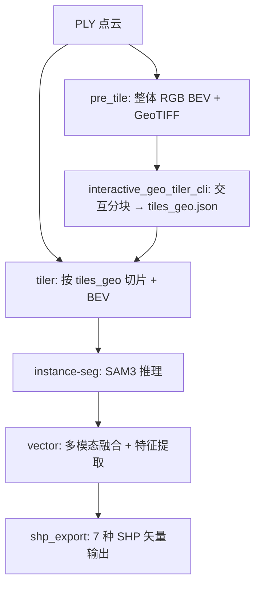

# 技术路线文档（landmark）

本文档梳理当前程序从点云到路面标线（车道线、箭头、禁停区 NSB）的端到端算法流程。

## 1. 总览

**目标**：从带强度、RGB 与语义属性的点云（PLY）中提取三类路面标记：
- **车道线（laneline）**：白色线状标记 → 旋转矩形框
- **箭头（arrow）**：路面方向标识 → 类型 + 位置 + 朝向
- **禁停区（NSB, No Stopping Box）**：黄色网格区域 → 旋转矩形框

**核心思路**：
1) 点云 → 俯视 BEV 图（强度灰度图 / RGB 图）。
2) SAM3（文本提示）分块推理得到实例 masks。
3) masks 后处理（面积过滤、NMS、连通域过滤、覆盖型去重）。
4) 每个 mask 拟合最小外接旋转矩形 → 初始 bbox。
5) 基于点云强度的 Otsu 精修（仅车道线）。
6) 多流水线结果合并与可视化。

## 2. 代码结构与模块职责

```
landmark/
├── core/
│   ├── arrow_ops.py       # 倒角匹配算法
│   ├── bbox_ops.py        # bbox 生成、融合、可视化
│   ├── mask_ops.py        # mask NMS、连通域过滤、覆盖型去重
│   └── models.py          # LandmarksPayload 数据模型
├── integrations/
│   ├── sam3.py            # SAM3 单图调用（conda run，text/point prompt）
│   └── sam3_about.py      # SAM3 分块批量推理 + 跨 tile 合并（--batch 模式）
├── io/
│   └── json_io.py         # bbox/landmarks JSON IO
├── pipelines/
│   ├── main_pipeline.py   # 车道线主流水线（SAM3 文本分割）
│   ├── arrow_pipeline.py  # 箭头提取（SAM3 + 倒角匹配）
│   ├── nsb_pipeline.py    # 禁停区提取（RGB BEV + SAM3）
│   ├── ext_pipeline.py    # RandLA 补充车道线（点交互 SAM3）
│   ├── street_bev_pipeline.py  # 全局合并与可视化
│   └── main_ext_pipeline.py    # 编排器（main→arrow→ext→merge）
├── apps/
│   ├── tiler.py           # 按 tiles_geo.json 将大 PLY 切为 tile PLY
│   ├── instance_seg.py    # SAM3 推理 + 跨 tile 合并（读 tiler 输出，按 mode 分别推理）
│   └── vector.py          # 后处理：bbox 提取/合并/BFS Otsu 精修、箭头 Chamfer 匹配
├── utils/
│   └── bev.py             # BEV 俯视图渲染工具（rgb/intensity/pred 三模式，CSF 地面滤波）
refine.py                  # bbox Otsu 精修（顶层模块）
utils_.py                  # PLY IO、地面过滤、BEV 渲染
```

## 3. 端到端流程

### 3.0 流水线执行顺序

```
pre_tile → tiler → instance-seg → vector → SHP export
```



#### pre_tile（`pre_tile.py`）

- 输入：整体 PLY 点云
- 处理：CSF 地面滤波 → BEV 渲染（默认输出 RGB，并额外输出 intensity）→ PNG + GeoTIFF
- 输出：`bev_rgb.png` + `bev_intensity.png` + `geo_meta.json`（含 `min_xy`, `max_xy`, `meters_per_pixel`）+ `bev_rgb.tif` + `bev_intensity.tif`
- GeoTIFF 供 `interactive_geo_tiler_cli.py` 读取（rasterio affine transform）
- geo_meta.json 供 `utils.export_geotiff_from_png` 及下游使用

### 3.1 点云读取与地面过滤

- 输入 PLY：`read_ply(pc_path, is_property=True)`
  - `points`: (N,3) xyz
  - `properties`: `scalar_Intensity`、`pred_randla`、RGB 等字段
- 地面过滤：
  - **Pipeline**：`get_ground_mask(properties)` — `pred_randla ∈ {6,7}` 视为 ground
  - **BEV 工具** (`landmark/utils/bev.py`)：使用 CSF（Cloth Simulation Filter）纯几何滤波，不依赖语义字段
- BEV 坐标系：`col = floor((x - min_x) / mpp)`，`row = (H-1) - floor((y - min_y) / mpp)`（Y 轴翻转）

### 3.2 BEV 图生成

- **强度 BEV**（`get_img`）：每像素取强度最大值，1%/99% 分位拉伸至 [0,255]
- **RGB BEV**（`get_rgb_img`）：每像素取最高点的 RGB 值
- 分辨率：`meters_per_pixel = 0.02 m/px`
- 输出 `bev_meta`：`{min_xy, max_xy, meters_per_pixel, width, height}`

### 3.3 SAM3 集成

两种调用模式：
- **文本提示**：`masks.py  "<prompt>"` → `*_sam3_output.npz`（masks 形状 `(K,1,H,W)`）
- **点提示**：`points.py  <points.npz>` → `*_sam3_points.npz`（用于 ext_pipeline）

### 3.4 大图分块推理（tiling）

所有使用 SAM3 的流水线均支持 tiling（SAM3 对 >2048px 图像检测能力下降）：
- `tile_size=(2048,2048)`，`tile_overlap=200px`
- stride = tile - overlap
- 每个 tile 独立 SAM3 推理 + tile 内 NMS
- masks 贴回全图 → 全局 NMS → 连通域过滤 → 覆盖型去重

### 3.5 SAM3 分块批量推理（`sam3_about.py`）

`landmark/integrations/sam3_about.py` 提供完整的 tile 级 SAM3 推理 + 后处理 + 跨 tile 合并流水线：

**调用方式**（命令行）：
```bash
python -m landmark.integrations.sam3_about \
    --bev outputs/rgb_bev.tif \
    --tiles outputs/tiles \
    --text "road marking" \
    --out-dir outputs/sam3_output \
    [--obj-straight]
```

**流程**：
1. **批量推理**：`conda run -n sam3 python masks.py --batch '[tiles...]' --text '...' --out '[dirs...]'`
   - 模型只加载一次，顺序推理所有 tile（`masks.py --batch` 模式）
   - 每个 tile 输出 `masks.npz`（masks/boxes/scores）
   - **多 prompt 支持**：`--text '["arrow","laneline"]'` → 逐 prompt 推理，输出到 `{out_dir}/{prompt}/masks.npz`
2. **Per-tile 后处理**：
   - 连通域过滤（`connected_components_filter`）：保留主连通域 + 面积比 ≥ 10% 的次要连通域
   - `--obj-straight` 时额外检查方向一致性（PCA 角度差 < 15°）
   - 覆盖型去重（`get_overlap_reduced_masks`）：小 mask 被大 mask 覆盖 ≥ 90% 时移除
3. **跨 tile 合并**（`cross_tile_merge`）：
   - Union-Find 归并：不同 tile 中空间重叠的 obj 合并为同一 ID
   - 同一 tile 内的 obj 始终保持独立
4. **输出**：`final_masks.npy`、`objs.png`、`objs.tif`（带地理坐标的 GeoTIFF）、`summary.json`

### 3.6 Instance-Seg 流水线（`instance_seg.py`）

`landmark/apps/instance_seg.py` 从 tiler 输出（BEV 图 + `geo_meta.json`）运行 SAM3 推理并合并结果。

固定推理四类目标：`arrow`、`crosswalk`、`yellow box`（→nsb）、`laneline`。每个 BEV 模式只调用一次 SAM3 batch（模型加载一次，逐 prompt 推理）。

```bash
uv run landmark-instance-seg outputs/tiles output/objs
uv run landmark-instance-seg outputs/tiles output/objs --modes rgb intensity
```

**输出结构**：
```
output/objs/
├── arrow/
│   ├── rgb/            # final_masks.npy, objs.png, summary.json
│   └── intensity/
├── crosswalk/
│   ├── rgb/
│   └── intensity/
├── nsb/                # prompt="yellow box"
│   ├── rgb/
│   └── intensity/
├── laneline/
│   ├── rgb/
│   └── intensity/
└── _tiles/             # SAM3 中间产物（per-tile masks）
    ├── rgb/
    └── intensity/
```

### 3.7 Vector 阶段（`vector.py`）

SAM3 推理完成后（`final_masks.npy` 已生成），Instance-Seg 自动进入 Vector 阶段，
将 masks 转为几何特征。可通过 `--no-features` 跳过。

```bash
# 默认包含后处理
uv run landmark-instance-seg outputs/tiles output/objs
# 仅 SAM3 推理，不做后处理
uv run landmark-instance-seg outputs/tiles output/objs --no-features
```

**后处理三步流水线**：

#### Step 1: Cross-mode 融合

对每个 prompt，将 `{prompt_dir}/rgb/final_masks.npy` 与 `{prompt_dir}/intensity/final_masks.npy`
合并为单一 `{prompt_dir}/fused/final_masks.npy`。

- 逐对象提取 crop，计算两模式间的 overlap ratio = `intersection / min(area_a, area_b)`
- overlap ≥ 0.5 的对象合并（取并集），其余保留为独立对象
- 输出每个 prompt 只有一个 fused label map，不再区分 rgb/intensity

#### Step 2: Arrow 擦除

从 roadmarking fused 结果中，删除与 arrow fused 结果高度重叠的对象
（`intersection / min(rm_area, arrow_area) ≥ 0.5`），避免箭头被重复计入 roadmarking。

#### Step 3: 特征提取

| prompt_dir | 处理方式 | 输出文件 |
|------------|---------|---------|
| laneline, roadmarking | `_iter_object_crops` → `_bbox_from_crop` → 合并同向 → BFS Otsu 精修 | `bboxes.json` |
| crosswalk | `_iter_object_crops` → `_bbox_from_crop` → 合并同向（不精修） | `bboxes.json` |
| nsb | `_iter_object_crops` → `_bbox_from_crop`（不精修） | `nsb_results.json` |
| arrow | `_iter_object_crops` → Chamfer 模板匹配（5 类×72 角度） | `arrow_results.json` |

> **内存优化**：不再调用 `_final_masks_to_individual` 将 label map 展开为 (K,H,W) bool 数组
> （237 对象×29002×7250 ≈ 50 GB），改为 `_iter_object_crops` 逐对象提取裁剪区域，
> 内存消耗降至 O(单对象裁剪区) 级别。

**BFS 精修策略**：
1. 构建 tile 邻接图（世界坐标边界相邻 = 邻居）。
2. 从 tile 0 开始 BFS 遍历：加载当前 tile PLY → 找出所有 corners_xy 落在当前 tile 内的未精修 bbox → 调用 `refine_bbox` → 释放 PLY。
3. 每个 bbox 只精修一次（首次被某 tile 覆盖时即精修）。

**输出结构**：
```
output/features/
├── arrow/            # arrow_results.json + arrow_vis.png + sam3_res/
├── crosswalk/        # bboxes.json + crosswalk_bboxes_vis.png
├── nsb/              # nsb_results.json + nsb_bboxes_vis.png
├── laneline/         # bboxes.json + laneline_bboxes_vis.png (BFS 精修)
└── roadmarking/      # bboxes.json + roadmarking_bboxes_vis.png
```

> **可视化**：每个特征提取函数自动生成 `*_vis.png`，将结果（OBB / 箭头矩形 + 类型标注）
> 绘制在 label-map 的彩色渲染图上（mpp=0.02，全分辨率）。

### 3.8 SHP 导出（`shp_export.py`）

将后处理结果导出为 ESRI Shapefile（面要素），可独立调用：

```bash
uv run landmark-shp outputs/apps/features outputs/apps/shp
uv run landmark-shp outputs/apps/features outputs/apps/shp --linearity 5.0
```

**八个导出函数**（按执行顺序）：

| 函数 | 输入 | 输出 | 说明 |
|------|------|------|------|
| `laneline_crosswalk_to_shp` | laneline + roadmarking bboxes, crosswalk bboxes | `laneline.shp` + `crosswalk.shp` | 合并 laneline/roadmarking bboxes → 线性过滤（length/width ≥ 3.0）→ 中心落入 crosswalk OBB 的归入 crosswalk.shp；对每组斑马线条纹拟合精确四边形区域（category=crosswalk），条纹本身为 category=zebra-line |
| `arrow_to_shp` | arrow_results.json + arrow_vertices.json | `arrow.shp` | 按 (theta, tx, ty) 变换模板顶点到世界坐标 |
| `nsb_to_shp` | nsb_results.json | `nsb.shp` | 直接写 OBB 四角 |
| `street_to_shp` | crosswalk.shp (精确区域) | `street.shp` | 从 crosswalk 区域推导 base_line/side_line → 调用 street_part 构建交叉口（4 条斑马线组合）+ 路段（射线追踪相邻斑马线） |
| `stopline_to_shp` | laneline.shp + street.shp + crosswalk.shp | `stopline.shp` | 参考 laneline_stopline：删去交叉口内 laneline → 近斑马线 side_line 且平行的归为 stopline → 正交扩展 → 更新 laneline.shp |
| `fence_to_shp` | CurbExtract centerlines.json + geo_mate.json | `fence.shp` | 像素坐标→世界坐标（geo_mate），近端点曲线合并（radius=1m, cos≥0.9），过滤短线(≥2m) → POLYLINE 线要素 |
| `belt_to_shp` | CurbExtract belt mask PNG + geo_mate.json | `belt.shp` | 调用 belt.py 向量化：连通域→膨胀分组→PCA拟合→几何拟合(edge lines + arc caps)→stadium多边形；可选排除 street.shp 区域 → POLYGON 面要素 |
| `long_laneline_to_shp` | objs mask (K,H,W) + bev_meta | `long_laneline.shp` | 骨架提取→连通域排序链接→10cm间隔控制点采样→3cm法向切片取边界→左右多段线构面 → POLYGON 面要素 |

**输出结构**：
```
shp/
├── laneline.shp/.shx/.dbf         # id, length, width, yaw, cx, cy（stopline 已拆出）
├── stopline.shp/.shx/.dbf         # id, length, width, yaw, cx, cy, cross_id
├── crosswalk.shp/.shx/.dbf        # category(crosswalk|zebra-line), id, cw_id, length, width, yaw, stripe_num
├── arrow.shp/.shx/.dbf            # id, type, score, yaw_deg, wx, wy
├── nsb.shp/.shx/.dbf              # id, length, width, yaw, cx, cy
├── street.shp/.shx/.dbf           # category(intersection|street), subcat, cross_ids, center_x, center_y
├── fence.shp/.shx/.dbf            # curve_id, src_count, length_m, merged
├── belt.shp/.shx/.dbf             # category, belt_id, src_ids, width_m, length_m
└── long_laneline.shp/.shx/.dbf    # id, length_m, area_m2, n_ctrl
```

> **`export_all_shp`** 提供一站式 API，自动从 features/ 目录读取所有 JSON → 写 SHP。

---

## 4. 车道线流水线（`main_pipeline.py`）

**入口**：`landmark_main_pipeline(pc_path, output_dir=...)`

**流程**：
1. 读取 PLY → 过滤地面点 → 生成强度 BEV → 保存 `lane_line.png`
2. SAM3 分块推理（文本提示 `"lane line"`）
3. **大面积过滤**：丢弃面积 > `max_mask_area`（默认 50000 px）的 mask（排除 NSB 等被误检为车道线的区域）
4. 全局 NMS（`iou_threshold=0.5`）
5. 连通域过滤 → 覆盖型去重（`cover_ratio=0.9`）
6. `get_init_bbox`：每个 mask → minAreaRect → 初始 bbox
7. （可选）`merge_overlapping_collinear_bboxes`：合并重叠同向 bbox
8. `refine_bboxs`：Otsu 精修 bbox 边界

**输出**（`roadmark_v3/main/`）：
- `lane_line.png`：BEV 强度图
- `init_bboxes.json`、`refined_bboxes.json`
- `init_bbox.png`、`refined_bbox.png`

**关键阈值**：
| 参数 | 默认值 | 说明 |
|------|--------|------|
| `tile_size` | (2048,2048) | tile 尺寸 |
| `tile_overlap` | 200 | 重叠像素 |
| `max_mask_area` | 50000 | 大面积 mask 过滤阈值 |
| `iou_threshold` | 0.5 | NMS IoU 阈值 |
| `overlap_cover_ratio` | 0.9 | 覆盖型去重阈值 |

### 4.1 masks 后处理细节

1. **NMS**（`mask_nms`）：按 score 从高到低，IoU ≥ 阈值则抑制
2. **连通域过滤**（`get_connected_components_filtered_masks`）：保留最大连通域 + 方向一致且面积足够的连通域（`area_ratio=0.1`, `angle_threshold=15°`）
3. **覆盖型去重**（`get_overlap_reduced_masks`）：大 mask 覆盖小 mask 超过 `cover_ratio` 则删小 mask

### 4.2 bbox 精修（`refine.py`）

Otsu 分割精修 bbox 边界：
1. bbox 坐标系 (axis1=长边, axis2=宽边)
2. 长度方向分段（每段 ≤ 15m），Otsu 二值化后在宽度方向 1D cut
3. 短边区域类似调整
4. 边界移动幅度限制 ≤ 0.20m

> **注意**：Otsu 精修仅适用于车道线（高对比度线条）。NSB（内部有间隔的网格）不适用。

---

## 5. 箭头流水线（`arrow_pipeline.py`）

**入口**：`landmark_arrow_pipeline(pc_path, output_dir=...)`

**流程**：
1. 读取 PLY → 生成强度 BEV（分块推理同车道线）
2. SAM3（文本提示 `"arrow"`）
3. **小面积过滤**：丢弃面积 < `min_mask_area`（默认 2000 px）的 mask
4. 倒角匹配（Chamfer Matching）：5 种模板 × 每个 mask
5. 输出匹配结果

**输出**（`roadmark_v3/arrow/`）：
- `arrow_results.json`：匹配结果列表
- `arrow_fitted_mask.png`：匹配模板的二值 mask（供 ext_pipeline 擦除使用）
- `arrow_matched_overlay.png`：全局叠加可视化

**关键阈值**：
| 参数 | 默认值 | 说明 |
|------|--------|------|
| `min_mask_area` | 2000 | 小面积 mask 过滤（真实箭头 ~5000-10000 px） |
| `iou_threshold` | 0.5 | NMS IoU 阈值 |

### 5.1 倒角匹配算法（`arrow_ops.py:chamfer_match`）

- 模板存储：`asserts/arrow_templates/`（5 种），预计算边缘 `asserts/arrow_edges/`
- mpp=0.02，不做尺度缩放
- **Phase 1**（粗搜）：mask 质心为锚点，72 步角度遍历 → Nelder-Mead 精搜
- **Phase 2**（裁尾，条件触发）：`fill_ratio < 0.5 AND overflow > 0.5` 时裁尾重搜
- 多模板选优：取全局最低倒角距离

**输出字段**：`type`, `score`, `theta`, `tail_frac`, `tx/ty`, `world_xy`, `world_yaw`, `overflow`, `fill_ratio`

### 5.2 可视化输出

- `arrow_intensity_bev.png`：强度 BEV 底图
- `sam3_res/mask_NNN.png`：各箭头 SAM3 mask
- `sam3_res/mask_NNN_crop.png`：裁剪后的强度子图
- `sam3_res/mask_NNN_fit.png`：最佳模板拟合叠加在强度图上的局部可视化
- `arrow_matched_overlay.png`：全局强度图 + 所有匹配模板轮廓叠加

---

## 6. 禁停区流水线（`nsb_pipeline.py`）

**入口**：`landmark_nsb_pipeline(pc_path, output_dir=...)`

**流程**：
1. 读取 PLY → 生成 **RGB BEV**（NSB 为黄色网格，RGB 更适合检测）
2. SAM3 分块推理（文本提示 `"yellow box"`）
3. **面积过滤**：丢弃面积 < `min_mask_area`（默认 5000 px）的 mask
4. `get_init_bbox`：每个 mask → minAreaRect
5. **不做 Otsu 精修**（NSB 内部有间隔，Otsu 会误判导致 bbox 缩小）

**输出**（`roadmark_v3/nsb/`）：
- `nsb_results.json`：`{bev_meta, nsb_bboxes}`
- `nsb_rgb_bev.png`：RGB BEV 底图
- `nsb_rgb_bev_sam3_output.png`：SAM3 叠加可视化

**关键阈值**：
| 参数 | 默认值 | 说明 |
|------|--------|------|
| `min_mask_area` | 5000 | 小面积 mask 过滤 |
| `tile_size` | (2048,2048) | tile 尺寸 |
| `tile_overlap` | 200 | 重叠像素 |

> **设计决策**：NSB 必须使用 RGB BEV（强度图上 NSB 与路面区分度不够）。SAM3 对大图（>2048px）检测 NSB 能力显著下降，tiling 是必须的。

---

## 7. RandLA 补充流水线（`ext_pipeline.py`）

**入口**：`landmark_ext_pipeline(pc_path, output_dir=...)`

**目标**：用 RandLA 语义预测补充 SAM3 漏检的车道线。

**流程**：
1. 读取 `main/init_bboxes.json` 获取已有 bbox
2. 提取 `pred_randla==6` 的标线点 → 投影为 BEV mask
3. **擦除已有区域**：
   - 擦除已有 bbox（extend_px=5）
   - 擦除箭头 mask（从 `arrow/arrow_fitted_mask.png`，膨胀 10px）
   - 擦除 NSB bbox（从 `nsb/nsb_results.json`，膨胀 10px）
4. remaining mask 后处理：密度过滤 → 5px 膨胀 → closing + hole filling → 3x3 开运算 → 小面积过滤
5. 连通域过滤（线形判断：PCA λ 比值 + 主方向对齐检查）
6. 每个连通域裁剪强度 BEV（≥1024×1024）→ SAM3 点提示
7. **大面积过滤**：丢弃面积 > `max_mask_area`（默认 50000 px）的 SAM3 mask
8. NMS → 连通域过滤 → 覆盖型去重
9. `get_init_bbox` → `refine_bboxs`（Otsu 精修）

**输出**（`roadmark_v3/ext/`）：
- `ext_bboxes.json`：补充 bbox 结果
- `randla_sam3/`：中间产物（连通域图、裁剪图）

**关键阈值**：
| 参数 | 默认值 | 说明 |
|------|--------|------|
| `max_mask_area` | 50000 | 大面积 mask 过滤 |
| `area_per_point` | 500 | 每 500px 面积采样 1 个点 |
| `min_points` / `max_points` | 1 / 10 | 每个连通域的采样点数范围 |
| `min_aspect_ratio` | 16.0 | 线形判断最低长宽比 |
| `align_angle_thresh_deg` | 10.0 | 主方向对齐容差 |

---

## 8. 全局合并与可视化（`street_bev_pipeline.py`）

**入口**：`merge_res_bboxes(base_dir, roadmark="roadmark_v3")`

**流程**：
1. 扫描所有 tile 的 `res/landmarks.json`，收集 laneline bbox
2. 扫描所有 tile 的 `arrow/arrow_results.json`，收集 arrow 结果
3. 扫描所有 tile 的 `nsb/nsb_results.json`，收集 NSB bbox
4. **NSB 区域车道线过滤**：若 laneline bbox 中心位于任意 NSB 多边形内，则删除该 laneline
5. 构建全局 BEV 画布（强度灰度底图）
6. 渲染：
   - **车道线**：绿色填充（α=0.3）+ 绿色边框
   - **箭头**：橙色（255,140,0）填充 + 边框（从 `arrow_fitted_mask.png` warp 到全局坐标）
   - **NSB**：黄色（255,220,0）填充（α=0.3）+ 黄色边框

**输出**（`RS/labeled/res_merge/`）：
- `res_merge.json`：`{global_meta, lanelines, arrows, nsbs}`
- `res_merge.png`：全局合并可视化（1x / 2x / 4x 缩放）

---

## 9. 编排器（`main_ext_pipeline.py`）

**入口**：`run_main_pipeline(pc_path, output_dir=...)`

单 tile 全流程编排：
1. `landmark_main_pipeline` → 车道线 bbox
2. `landmark_arrow_pipeline` → 箭头
3. `landmark_ext_pipeline` → 补充 bbox
4. 合并 main + ext laneline bbox → `res/landmarks.json`（`LandmarksPayload` 格式：`{bev_meta, laneline, arrows}`）
5. 输出可视化 `res/landmarks.png`

---

## 10. 输入/输出约定

### 输入
- 点云路径：`RS/labeled/road{num}_out/road{num}_with_labels.ply`
- 必需属性：`scalar_Intensity`、`pred_randla`
- 可选属性：`red`/`green`/`blue`（RGB BEV 用于 NSB）、`pred_m2f`、`pred_spt`

### 输出目录结构（以 road3-4 为例）
```
RS/labeled/road3-4_cache/roadmark_v3/
├── main/           # 车道线主流水线
│   ├── lane_line.png
│   ├── init_bboxes.json
│   ├── refined_bboxes.json
│   ├── init_bbox.png
│   └── refined_bbox.png
├── arrow/          # 箭头
│   ├── arrow_results.json
│   ├── arrow_fitted_mask.png
│   └── arrow_matched_overlay.png
├── nsb/            # 禁停区
│   ├── nsb_results.json
│   └── nsb_rgb_bev.png
├── ext/            # RandLA 补充
│   ├── ext_bboxes.json
│   └── randla_sam3/
└── res/            # 合并结果
    ├── landmarks.json
    └── landmarks.png
```

### 全局合并输出
```
RS/labeled/res_merge/
├── res_merge.json      # {global_meta, lanelines, arrows, nsbs}
├── res_merge.png       # 全局可视化
├── res_merge_2x.png
└── res_merge_4x.png
```

### `res_merge.json` 结构
```json
{
  "global_meta": {
    "min_xy": [x, y],
    "max_xy": [x, y],
    "meters_per_pixel": 0.02,
    "width": W,
    "height": H
  },
  "lanelines": [
    {"id": 0, "center": [x,y,z], "yaw": rad, "size": [len,wid], "corners_xy": [[x,y],...], "source": "..."}
  ],
  "arrows": [
    {"type": "straight", "world_xy": [x,y], "world_yaw": rad, "score": 0.9, ...}
  ],
  "nsbs": [
    {"id": 0, "center": [x,y,z], "yaw": rad, "size": [len,wid], "corners_xy": [[x,y],...]}
  ]
}
```

---

## 11. 批量执行脚本

| 脚本 | 用途 |
|------|------|
| `run_arrow.sh` | 所有 tile 执行箭头流水线 |
| `run_nsb_ext_bev.sh` | 所有 tile 执行 NSB → ext → street_bev |
| `test.sh` | 单 tile 测试 |

---

## 12. 关键阈值汇总

| 参数 | 位置 | 默认值 | 说明 |
|------|------|--------|------|
| `max_mask_area` | main_pipeline | 50000 px | 过滤 NSB 等误检为车道线的大 mask |
| `min_mask_area` | arrow_pipeline | 2000 px | 过滤噪声小 mask（真实箭头 5000-10000 px） |
| `min_mask_area` | nsb_pipeline | 5000 px | 过滤噪声小 mask |
| `max_mask_area` | ext_pipeline | 50000 px | 过滤 SAM3 点交互产生的大面积 mask |
| `tile_size` | 所有流水线 | (2048,2048) | SAM3 分块尺寸 |
| `tile_overlap` | 所有流水线 | 200 px | 分块重叠 |
| `iou_threshold` | NMS | 0.5 | mask IoU 抑制阈值 |
| `cover_ratio` | 覆盖型去重 | 0.9 | 大 mask 覆盖小 mask 的删除阈值 |
| `min_aspect_ratio` | ext_pipeline | 16.0 | 连通域线形判断 |
| `max_segment_length_m` | refine | 15m | Otsu 精修分段长度 |
| `max_shift` | refine | 0.20m | 精修边界最大移动幅度 |

---

## 13. 常见问题（Troubleshooting）

1. **SAM3 检测不到 NSB** — 图像太大（>2048px），需要 tiling。已内置支持。
2. **tile 里有 mask 但 init_bbox 没有** — 排查 tile 内 NMS、大面积过滤、连通域过滤。
3. **NSB 被当成车道线** — `max_mask_area=50000` 过滤 + street_bev 中 NSB 区域内车道线删除。
4. **Otsu 精修后 bbox 缩小** — Otsu 不适用于 NSB 等内部有间隔的目标（NSB 跳过精修）。
5. **SAM3 环境不可用** — 需要：conda + `sam3` 环境 + `OpenSource/sam3/masks.py` 路径正确。

---

## 附录 A. 倒角匹配算法详情

### A.1 原理

将目标 mask 转化为距离场，模板边缘在场中寻找势能最低位姿。相比像素级匹配，对局部缺失、噪声、形变有更强容忍度。

### A.2 算法步骤

**目标图处理**：mask Canny 边缘 → 距离变换 → 质心锚点。

**模板处理**：`asserts/arrow_templates/` 5 种 PNG，预计算边缘 `asserts/arrow_edges/`。mpp=0.02，不做尺度缩放。

**损失函数**：模板边缘点旋转 θ + 平移 (tx,ty) 后在距离场中采样，取均值（越小越好）。

**搜索策略**：
- Phase 1：72 步角度粗搜 → Nelder-Mead 精搜
- Phase 2（条件触发：`fill_ratio<0.5 AND overflow>0.5`）：裁尾 + 重搜

**坐标转换**：
```
world_x = tx * mpp + min_xy[0]
world_y = (H-1-ty) * mpp + min_xy[1]
world_yaw = -theta
```
